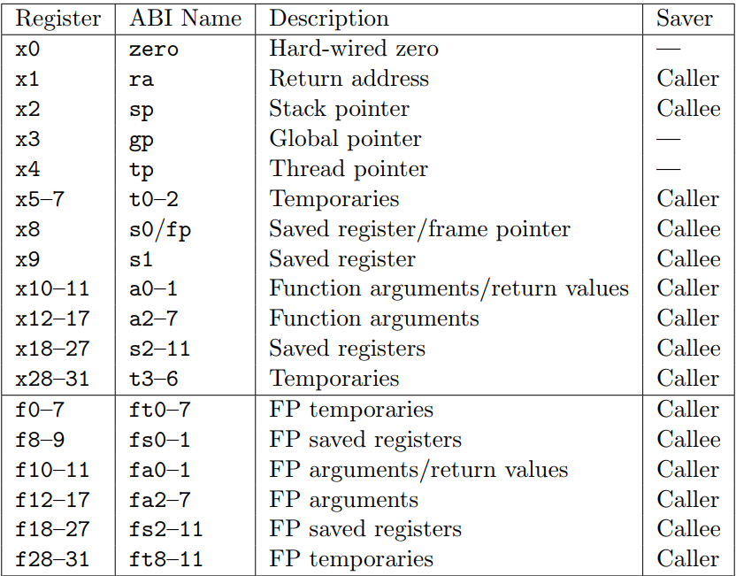
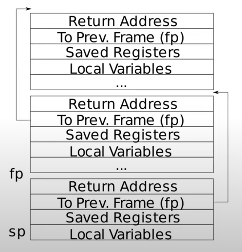

# Overview and Resources
2021 版本 [6.S081](https://pdos.csail.mit.edu/6.828/2021/schedule.html) 课程笔记

GDB 调试
1. [JYY 2022 OS Lec18](https://www.bilibili.com/video/BV1DY4y1a7YD/?spm_id_from=333.337.search-card.all.click&vd_source=23623f3df2ae5a43e7d90945c9b7eb98)
2. [sanbuphy 优雅的调试在vscode上完美调试xv6](https://sanbuphy.github.io/p/%E4%BC%98%E9%9B%85%E7%9A%84%E8%B0%83%E8%AF%95%E5%9C%A8vscode%E4%B8%8A%E5%AE%8C%E7%BE%8E%E8%B0%83%E8%AF%95xv6/) 使用的 gdb 不是 `gdb-riscv64-unknown-elf`, 而是 `gdb-multiarch`
3. [Stackoverflow Debugging user code on xv6 with gdb](https://stackoverflow.com/questions/10534798/debugging-user-code-on-xv6-with-gdb)
4. [Yale CS422 2011 Lec2 HW](https://web.archive.org/web/20190308091152/http://zoo.cs.yale.edu:80/classes/cs422/2011/lec/l2-hw)
5. [MIT 6.S081 xv6调试不完全指北](https://www.cnblogs.com/KatyuMarisaBlog/p/13727565.html)

安装: 
https://pdos.csail.mit.edu/6.828/2021/tools.html

Lab Guidance: 
https://pdos.csail.mit.edu/6.828/2021/labs/guidance.html

[TO DO]
1. Lab Net
2. All the papers talked in the class.
3. Maybe modern OS concepts.

# Operating System Interface

shell 一个 user program. 
## Memory and Processes

`fork()`: 
+ 会创建一个新的进程，新进程是调用进程的副本，新进程会继承调用进程的所有资源，包括内存, 文件描述符, **程序计数器**, 信号处理函数等.
+ 父进程和子进程在 `fork()` 后拥有独立的地址空间. 
+ 由于大多数时候子进程在启动后会立即执行 `exec()` 来加载一个新程序, 因此内存的完整复制常常是不需要的开销. **写时复制(copy-on-write)** 技术可以用来优化内存的复制, 父进程和子进程共享相同的物理内存，直到其中一个进程尝试写入内存时，内核才会为写入进程分配新的物理内存.
+ 父进程和子进程的执行顺序是不确定的，取决于内核的调度策略, 特别是在多核系统上.
+ `fork()` 返回两次，父进程中返回子进程的进程ID，子进程中返回0，如果出现错误则返回 -1. 

> 如何调试调用了 `fork()` 的程序:
> 1. 在 fork 之前设置断点, GDB 提供了 set follow-fork-mode 命令, 可以设置在 fork 之后是跟随子进程还是父进程.
> 2. 可以在子进程中添加一段代码, 暂停子进程的执行, 等待一个 gdb 实例附加到该子进程上.


`int wait(int *status)`:
+ 父进程调用 `wait()` 来等待子进程的结束，如果子进程已经结束，`wait()` 会立即返回子进程的 pid，否则会阻塞父进程直到子进程结束.
+ 如果有多个子进程, `wait()` 只会等待其中一个子进程结束，如果需要等待所有子进程结束，可以循环调用 `wait()` 
+ `status` 用来存储子进程的退出状态，如果不关心子进程的退出状态，可以传入 `NULL`.

`exec()`:
+ 用来加载一个新的程序到当前进程的地址空间中，替换当前进程的代码段, 数据段, 堆栈等.
+ `exec()` 会覆盖当前进程的内存空间，除非出错, 否则不会返回原来的进程, 即 `exec()` 语句之后的代码不会被执行.

`int getpid()`: 获取当前进程的进程ID 

## I/O and File Descriptors
每个进程都有一个表记录与该进程相关的文件描述符，文件描述符是一个非负整数，用来标识一个打开的文件或者其他I/O对象.文件描述符抽象了文件, 管道和设备等差异
文件描述符0, 1, 2分别是标准输入, 标准输出, 标准错误.
+ 每一个文件描述符都有一个 offset，用来记录文件读写的位置.`fork()` 会保留文件描述符的 offset.

### File API
`read(fd, buf, count)`:
+ 从文件描述符 `fd` 中读取 `count` 个字节到 `buf` 中，返回实际读取的字节数，如果返回值小于 `count`，则表示已经读到文件末尾.

`write(fd, buf, count)`:
+ 将 `buf` 中的 `count` 个字节写入到文件描述符 `fd` 中，返回实际写入的字节数，如果返回值小于 `count`，则表示写入失败.

`close(fd)`:
+ 关闭文件描述符 `fd`，释放资源, 之后使用 `open()`, `pip` 等函数重新打开文件时返回的总是**最小的未使用的**文件描述符.

`int open(path, flags)`: 打开一个文件，返回一个文件描述符
+ flags: `O_RDONLY`, `O_WRONLY`, `O_RDWR`, `O_CREATE`, `O_TRUNC` 等

`int dup(int fd)`: 复制文件描述符，返回一个新的文件描述符，指向与原文件描述符相同的文件. 

## Pipes
A pipe is a small kernel buffer exposed to processes as a pair of file descriptors. 创建一个 pipe 本质上是创建了一个内核缓冲区, 管道两端的两个进程利用手上的两个文件描述符来访问这个内核缓冲区, 进行进程间通信.
如果没有数据可读, read 会阻塞, 直到有新的数据写入或者管道被关闭. 如果管道被关闭, read 会返回 0. 

`pipe(int fds[2])`:
+ 创建一个管道，返回两个文件描述符，`fds[0]` 用于读取数据，`fds[1]` 用于写入数据.
+ 
## File System

**Device file**（设备文件）是操作系统中用于访问和控制硬件设备的特殊文件.在 UNIX 和类 UNIX 系统（如 Linux）中，设备文件位于 `/dev` 目录下，通过文件系统接口提供对设备的访问.
1. **抽象硬件设备：**
   - **统一接口：** 设备文件为硬件设备提供了一个统一的接口，使得用户和应用程序可以通过标准的文件操作（如读写文件）来与设备进行交互.
   - **抽象层次：** 设备文件将硬件设备的操作抽象成文件操作，屏蔽了硬件的复杂性和差异性，使得对设备的操作更加简便和一致.

2. **设备文件的类型：**
   - **字符设备文件（Character Device File）：** 以字符流的方式进行数据传输的设备，例如串口设备, 键盘, 鼠标等.字符设备文件可以通过 `/dev` 目录下的 `crw-rw-rw-` 标志来识别，其中 `c` 表示字符设备.
   - **块设备文件（Block Device File）：** 以块为单位进行数据传输的设备，例如硬盘, SSD 等.块设备文件可以通过 `/dev` 目录下的 `brw-rw-rw-` 标志来识别，其中 `b` 表示块设备.

3. **设备文件的创建和管理：**
   - **主设备号和次设备号：** 每个设备文件都有一个主设备号（Major Number）和次设备号（Minor Number）.主设备号标识设备类型和驱动程序，次设备号标识具体的设备实例.
   - **设备文件的创建：** 设备文件通常由操作系统在启动时或设备驱动程序加载时创建，也可以通过 `mknod` 命令手动创建.


`fstat(int fd, struct stat *buf);`: 用于获取与文件描述符相关的文件的状态信息
+ 避免了多次路径解析带来的开销，特别是在需要频繁获取文件状态的情况下. 
+ 使用文件描述符而不是文件路径，减少了路径变化或路径注入攻击的风险. 

`stat(const char *path, struct stat *buf);`: 用于获取与文件路径相关的文件的状态信息

`link(const char *oldpath, const char *newpath)`: 用于在文件系统中创建硬链接，同一个 data file 提供多个名称，从而实现文件数据的共享和管理.

`unlink(const char *path)`: 用于删除文件系统中的文件，如果文件的硬链接数为0, 且没有 file descriptor 引用该文件, 则文件的数据块会被释放.

Unix 提供了一系列 file utility functions, 比如 mkdir, rmdir 等; cd 是一个 shell built-in command,
### 设备文件的使用

1. **读写设备文件：**
   - **文件操作接口：** 用户和应用程序可以使用标准的文件操作接口（如 `open`, `read`, `write`, `ioctl` 等）来对设备文件进行操作，从而与底层硬件设备进行交互.
   - **设备驱动程序：** 设备文件的读写操作最终由设备驱动程序处理.驱动程序负责将文件操作转换为设备特定的操作指令，并与硬件进行交互.

2. **示例：**
   - **读取串口设备数据：** 通过 `/dev/ttyS0` 文件，可以读取串口设备的数据：
     ```c
     int fd = open("/dev/ttyS0", O_RDONLY);
     char buffer[100];
     read(fd, buffer, sizeof(buffer));
     close(fd);
     ```
   - **写入硬盘数据：** 通过 `/dev/sda1` 文件，可以向硬盘分区写入数据：
     ```c
     int fd = open("/dev/sda1", O_WRONLY);
     char data[] = "Hello, world!";
     write(fd, data, sizeof(data));
     close(fd);
     ```


# Operating System Organization

**Monoithic kernel**: 一种操作系统涉及模式，所有的操作系统功能都在一个大的内核中实现，包括文件系统, 设备驱动, 进程管理等.
**Microkernel**: 一种操作系统结构，kernal space 中只包含最基本的功能，如进程调度, 内存管理, 进程间通信等，其他功能如文件系统, 网络协议栈, 设备驱动等都在用户空间中实现.

# Page Tables

给每一个进程分配一个独立的地址空间，每个地址空间都是从 0 开始的连续地址空间，每个地址空间都有一个 page table 用来映射虚拟地址到物理地址.

Memory Management Unit（MMU）: 用来将虚拟地址转换为物理地址，MMU 通过 page table 来实现地址转换.
+ 内存保护: MMU 提供对内存的访问控制, page table 中的每一项都包含了一些额外的信息，如读写权限, 执行权限等
+ 虚拟内存支持 (Virtual Memory Support): 虚拟内存技术可以使用比实际物理内存更多的地址空间, 虚拟内存通过在内存和磁盘之间交换页面来实现. 

SATP 寄存器 (Supervisor Address Translation and Protection): 用来存储 page table 的基地址, 用来实现地址转换. 对于 RV64, satp 寄存器的字段如下:
+ Mode (bits 63–60): 这4位指定了地址转换和保护的模式.例如，在 SV39 模式中，这个字段的值为 8.
+ ASID (bits 59–44): 地址空间标识符（Address Space Identifier），用于进程之间的地址空间隔离.这个字段帮助硬件区分不同进程的地址空间，从而减少 TLB（Translation Lookaside Buffer）刷新操作的频率.
+ PPN (bits 43–0): 页表基址物理页号（Physical Page Number），指定根页表在物理内存中的位置.这个字段包含根页表的物理地址.
当 SATP 寄存器设置完成, 之后看到的所有地址都将是一个虚拟地址, page table hardware 负责将虚拟地址转换为物理地址, 完成对内存的引用. 

### Page Table Entry (PTE)

完全基于地址的操作效率很低, 因此使用一个固定大小的 page 来减少 page table 的大小. 
在 RV64 中, 一个 64-bit 的 va 可以分为 3 个部分:
+ 前 25 bit 没有使用
+ 12 bit 的 Offset: 用来索引 page 中的具体地址
+ 27 bit 的 Index: 用来索引 page table. 一个三级页表, 每个页表项是使用 9 个 bit 来索引下一级的页表. 三级页表的好处在于如果 top level 的某个pte 为空, 则不需要分配下一级的页表, 此外, 每个页表有 2^9 = 512 个页表项, 一个页表项是 8 byte, 因此一个页表的大小是 4KB 和一个 page 的大小相同, 方便内存中对齐. 

一个页表项由以下字段组成:
+ 44 bit, PPN (Physical Page Number): 页表项指向的下一级页表或者物理页的物理页号.
+ 10 bit 的 Flags: 包含了一些标志位, 如读写权限, 执行权限等, 保留了 3 个 bit 用来给软件使用. 
剩余了 10 bit 可以在需要的时候拓展. 

一个真实的物理地址是由 PPN 和 Offset 组成的 56-bit 地址.

TLB (Translation Lookaside Buffer): Cache of page table entries, 用来缓存最近的地址转换结果, 以减少 MMU 的访问次数.
切换进程时, 需要刷新 TLB, 以避免地址转换错误.

Identity Mapping: xv6 使用了 identity mapping, 小于 PHYSTOP 的虚拟地址和实际物理地址是相同的. 

# RISC-V Assembly

Calling convention: [详见](../RISC-V/RISCV%20calling%20convention.pdf)
**caller saved registers** will not be preserved across function calls, which means that the caller must save these registers if they want to use them after the function call. 
**Callee saved registers** will be preserved across function calls, which means that the callee must save these registers if they want to use them. 


+ s0 在许多情况下会作为帧指针（frame pointer），用来指向当前栈帧的基地址，方便在函数体中访问局部变量或函数参数

**stack frame**:
遵循一定的顺序, 从高地址到低地址, 依次是: return address, prev frame pointer, saved registers, local variables.



16 字节对齐, callee 需要保存调用者的寄存器

# System Call Entry/Exit

在发生 1. 系统调用, 2. Exception, 3. Device Interrupt 时, CPU 会从用户态切换到内核态, 这个过程称为 trap.

硬件状态: 32 个通用寄存器, PC, MODE(执行模式), SATP, STVEC, SEPC, SCAUSE, SSTATUS, SSCRATCH ... 
- STVEC: 保存 trap handler 的地址, where the kernel gets control. 
- SEPC: 保存发生 trap 时的 PC (PC 在 trap 之后会被 STVEC 中的地址替换)
- SCAUSE: 记录 trap 的原因 
- SSTATUS: SIE 位用来控制是否开启中断, SPP 位用来记录 trap 之前的模式, 即 trap 的来源.
- SSCRATCH: 用来辅助保存 trap handler 的上下文

为了维护 Isolation, 同时使上下文的切换对于用户程序是透明的, trap 发生时, 需要保存用户的寄存器状态, 同时将 PC 指向 trap handler 的入口地址. 

内核运行在 Supervisor Mode, supervisor mode 相比于 user mode 可以多做一些事情:
- 可以访问没有设置 PTE_U 的页, 但是内核也不能直接访问任意的物理地址, 对物理地址的访问仍然需要通过页表控制. 
- 读写控制寄存器 (SATP 等一系列 S 开头的寄存器)

当读到一个 ecall 指令, 会发生以下一系列的代码调用:
ecall -> uservect(In TRAMPOLINE) -> usertrap -> syscall() -> usertrapret -> uservectret(In TRAMPOLINE). 

当 trap 发生, 硬件首先会完成以下操作:
1. 将用户 PC 保存于 SEPC 寄存器
2. 把 PC 设置成 STVEC 寄存器中保存的 trap handler 地址
3. 切换到 supervisor mode. 

STVEC 保存的是 trap handler 的地址, 这个地址在 TRAMPOLINE 页中, 由于 TRAMPOLINE 页在用户以及内核空间中映射在了相同的地址, 因此切换到内核页表后, 内核知道 trap handler 的地址.

# Page Faults

Virtual Memory 的主要功能是实现 isolation, 同时提供了一定程度的 indirection. 在 xv6 的实现中, 利用 VM 静态地实现了 shared trampoline page, guard page 的功能, 在现代的操作系统中, VM 还有很多其他的功能, 如 copy-on-write, lazy allocation, memory-mapped files 等, 这些很多功能都是通过发生 page fault 时动态地改变页表来实现的. 

page fault 是一种特殊的 trap, 触发 page fault 的 va 保存在 stval 寄存器中, 原因储存在 scause 寄存器中. 发生页错误后需要重新执行引起 page fault 的指令. (这一点和系统调用不同, 在发生 ecall 的时候, `usertrap.c` 中增加了 epc 的值, 这是因为 trap 会把引起 trap 的指令的地址保存在 sepc 中)

在 RISCV 中, page fault 会发生在以下几种情况:
1. `scause = 12`: Instruction page fault (caused by an instruction fetch)
2. `scause = 13`: Load page fault (caused by a read)
3. `scause = 15`: Store/AMO page fault (cause by a write)

Lazy/On-demand allocation: 
应用程序总是会申请比实际需要的内存更多的内存, 但是并不是所有的内存都会被使用, 因此在应用程序发出 `sbrk` 系统调用的时候, 内核只是简单地增加了 `sz` 的值. 当应用程序访问这些内存的时候, 会触发一个 page fault, 内核检查这个 page 是否在堆内存中, 如果在, 则分配一个新的物理页, 并将这个页映射到这个虚拟页上.

one zero-filled page: 
在进程初始化的阶段, 可以将 .bss 段的数据映射到一个全是 0 的只读物理页上, 这样就可以避免在进程初始化的时候, 为 .bss 段分配物理页, 节省了内存. 如果程序试图写入这个页, 会触发一个 page fault, 然后内核会分配一个新的物理页, 并将这个页映射到这个虚拟页上.

Copy-on-write fork, COW:
在朴素的 fork 中, 创建一个新的进程时, 需要复制父进程的整个地址空间, 这个过程涉及大量的内存引用, 但是大多数情况下, 子进程会立即调用 exec 来加载一个新的程序, 因此这个内存的复制是不必要的. COW 机制在 fork 的时候, 只会复制父进程的页表, 并将这些页表的权限设置为只读, 当尝试写入这些页的时候, 会触发一个 page fault, 然后内核会分配一个新的物理页, 并将这个页映射到发生错误的虚拟页上, 同时将这个页表项的权限设置为可读写. 

为了区分 COW 页和普通的页, PTE 中 10 bit 的 Flags 实际上给 supervise software 保留了 3 个 bit, 可以使用其中的一个 bit 来标记这个页是 COW 页.

此外, COW 机制导致了一个物理页可能被多个进程引用, 因此需要实现类似 file system 的 ref count. 一点优化: if a process incurs a store page fault and the physical page is only referred to from that process’s page table, no copy is needed.

Demand paging:
在 exec 中, 内核需要将程序的代码和数据从磁盘加载到内存中, 但是 I/O 很慢, 且不是所有的指令和数据都会被立刻使用. Demand paging 机制会分配 PTE, 但是不会设置 PTE_V, 只有在程序访问某个 page 的时候, 才会将这个 page 从磁盘加载到内存中. 

Demand paging 需要记录页在磁盘中的位置等元数据, 保存这类数据的数据结构称为 Virtual Memory Area (VMA). 
> Virtual Memory Area (VMA) 是操作系统内核中管理进程地址空间的一种数据结构. VMA 用于描述进程的虚拟地址空间中的一段连续内存区域，包括起始地址、结束地址、访问权限、映射文件等信息. 每个进程都有一个 VMA 列表，用于管理进程的虚拟地址空间. 

Memory-mapped files:
...

[Strategy for evicting pages] 

# Interrupt

Asynchronous, concurrent, programmed device I/O

software, timer, external device. 

programming I/O 通过 memory mapped I/O 映射到内核的地址空间, 可以通过 ld/st 指令来读写设备的控制寄存器. 

plit and clinet:


# Lock

Lock 的使用对程序设计的 Modularity 可能会有影响, 因为我们需要知道一个函数是否需要锁, 需要哪些锁. 

Re-entrant Lock: 可重入锁, 一种允许同一个线程多次获取的锁. 比如在递归函数中, 如果一个函数在某个深度持有锁, 函数再次被递归调用时无需被阻塞. 其劣势在于, 需要记录线程 ID 和计数器信息, 此外, 如果锁用于确保某个函数只会被执行一次, 可重入锁可能会导致函数被执行多次.

自旋锁和中断处理: 在 xv6 中, 比如如果 `sys_sleep` 得到了 `tickslock`, 但是随即被定时器中断打断, 定时器中断也需要 `tickslock`, 但是 `tickslock` 已经被 `sys_sleep` 持有, 此时定时器中断会自旋等待 `tickslock` 被释放, 这时候就产生了死锁. 所以如果中断处理程序使用自旋锁, 则 CPU 绝不能在启用中断的情况下持有该锁. 

xv6 采用了更保守的策略: 当一个 CPU 获取了一个锁, 会禁用中断, 这样中断处理程序就不会持有锁, 但是其他 CPU 仍然可以持有这个锁. 

当 CPU 没有持有自旋锁时, 则需要恢复中断, acquire 次调用 push_off 和 release 调用 pop_off 跟踪当前 CPU 上锁的嵌套级别. 当该计数达到零时，pop_off 恢复最外层临界区开始处存在的中断使能状态。

内存屏障: __sync_synchronize() 用于确保所有在屏障之前的读写操作会先于屏障之后的所有操作. 

可以使用同步队列 (sync queue) 等更高级别的构造来隐藏锁的细节, 从而减少死锁的可能性.

# Thread Switching

xv6 中的每一个进程都有一个内核栈, 用来保存进程的内核状态, 当进程从用户态切换到内核态时, 会使用这个内核栈. 

从一个线程切换到另一个线程时, 发生了以下几个步骤:
- user -> kernel; saves user registers in trapframe
- kernel thread -> scheduler thread; saves kernel thread registers in context
- scheduler thread -> kernel thread; restores kernel thread registers from ctx
- kernel -> user; restores user registers from trapframe

scheduler thread 是一个特殊的内核线程, 每个 CPU 都有一个单独的 scheduler thread. 

睡眠锁: 
- Sleep-lock 不能在中断处理程序中使用, 因为中断处理程序的设计是要尽快完成, 不能阻塞.

Lost wakeup: xv6 中线程进入休眠的函数 `sleep(void *chan, struct spinlock *lk)` 包含了两个参数, ... 
这也是为什么条件变量需要和一个锁关联. 

所有的 exit 进行 re-parenting, 设置 parent 为 initproc, state 为 ZOMBIE, 
都需要有 wait 来等待子进程结束, 以避免僵尸进程.

`kill()` 只会设置一个 killed 标志, 然后如果进程在 sleep 的时候, 会被设置成 RUNNABLE, 从而被调度器调度.

# File System 

文件系统的目的是提供一个统一的接口, 用来管理文件和目录, 并提供对文件的读写操作. 

关于文件系统, 应该形成以下几个问题的答案: 
- 磁盘上的哪些结构存储文件系统的数据和元数据？
- 当一个进程打开一个文件时会发生什么？
- 在读取或写入期间访问哪些磁盘结构？


[File System Layers](images/file_system_layers.png)

术语:
- Sector: 通常指磁盘上的一个扇区, 通常是 512 bytes
- Block: 通常指文件系统中的一个逻辑块, 通常是 4KB(NTFS, Ext4)

[Disk Layout](images/disk_layout.png)
- Boot block: 引导块, 存储引导程序, 用来引导操作系统.
- Super block: 超级块, 存储文件系统的元数据, 如文件系统的大小, inode 的数量等.
- Inode blocks: 存储 inode, inode 是文件的元数据, 如文件大小, 创建时间, 修改时间等.
- Data blocks: 存储文件的数据.
- Log: 日志, 用来记录文件系统的操作, 以保证文件系统的一致性.
- Bitmap: 位图, 用来记录数据块的使用情况.

## Buffer Cache

Buffer cache 的使用有两个目的, 1. caching, 2. 同步对磁盘的访问.

大体上, xv6 的 buffer cache 是一个有限长度的双向链表, 使用 LRU 策略来替换缓存.

每个 buf 的定义如下:
``` c
struct buf {
  int valid;   // has data been read from disk? 是否从磁盘读入完成
  int disk;    // does disk "own" buf? 是否已经写入磁盘
  uint dev;
  uint blockno;
  struct sleeplock lock; // Per-buf 的睡眠锁, 限制只有一个内核线程可以访问. 
  uint refcnt;
  struct buf *prev; // LRU cache list
  struct buf *next;
  uchar data[BSIZE];
};
``` 

buffer cache 的定义如下:
``` c
struct {
  struct spinlock lock;
  struct buf buf[NBUF];

  // Linked list of all buffers, through prev/next.
  // Sorted by how recently the buffer was used.
  // head.next is most recent, head.prev is least.
  // 双向的循环列表
  struct buf head;
} bcache;
``` 
- bacehe 的锁实际上保护 1. 链表的修改, 2. buffer 的 refcnt, 3. buffer 的 valid 和 disk 字段的修改.

`bget(uint dev, uint blockno)`: 尝试从 buffer cache 中获取一个 locked buffer, 如果没有, 则淘汰一个 used buffer, 修改其 dev 和 blockno, 并返回. 

`bread(uint dev, uint blockno)`: 调用 `bget` 来获取一个 buffer, 如果 buffer 的 valid 为 0, 则调用 `virtio_disk_rw` 从磁盘中读取数据到 buffer 中.

`bwrite`: 将 buffer 中的数据写入到磁盘中.

`brelse`: 释放 buffer 的锁, 如果 buffer 的 refcnt 为 0 (即没有其他线程想要使用这个 buffer), 则将 buffer 移到 LRU cache list 的头部.

`bpin`, `bunpin`: 用来增加和减少 buffer 的 refcnt, 用于将某个 buffer 锁定在内存中, 防止被替换.

## Log
 
## Block Allocator

`mkfs` 用来初始化文件系统, 会创建超级块, inode table, bitmap 等数据结构.

`balloc` 和 `bfree`: 前者检查 bitmap block 来分配一个 zerod 数据块, 后者将对应的数据库重新标为可用. bitmap block 本身是常驻在 bcache 中的, 因此两个进程对 bitmap 的互斥访问是由 buffer cache 保证的. 此外这两个函数的调用必须包含在事务中. 

## Inode 

Inode: 索引节点, 用于存储文件的元数据, 如文件大小, 创建时间, 修改时间, 文件权限等. 

xv6 中的 on disk inode 结构体包含了以下字段:
``` c
struct dinode {
  short type;           // File type
  short major;          // Major device number (T_DEVICE only)
  short minor;          // Minor device number (T_DEVICE only)
  short nlink;          // The number of directory entries that refer to this inode
  uint size;            // Size of file (bytes)
  uint addrs[NDIRECT+1];   // Data block addresses
};
```
- type: 文件类型, 如普通文件, 目录, 设备文件等. 0 表示未使用. 
- major, minor: 设备文件的主设备号和次设备号
- nlink: 文件的硬链接数
- size: 文件的大小
- addrs: 文件的数据块地址, 包括直接块和间接块. 这部分实际规定了文件系统中文件的大小上限. 
> 基于指针的块索引不是唯一的实现方式, 例如 Linux ext4 文件系统使用了 extent-based 的块索引方式, 通过 extent 来记录文件的数据块范围, 而不是通过指针来索引数据块.

内存中的 inode 结构体和磁盘中的 inode 结构体是不同的, 内存中的 inode 结构体包含了更多的信息, xv6 中的 inode 结构体定义如下:
``` c
struct inode {
  uint dev;           // Device number
  uint inum;          // Inode number
  int ref;            // Reference count
  struct sleeplock lock; // protects everything below here
  int valid;          // inode has been read from disk?

  // on disk inode
  ... 
}
```
- ref: C pointers referring to the in-memory inode. Pointers to an inode can come from file descriptors, current working directories, and transient kernel code such as exec.

内存中驻留的 inode 保存在一个表 itable 中. 
``` c
struct {
  struct spinlock lock;
  struct inode inode[NINODE];
} itable;
```
- itable 的锁保护了 inode 的 ref, dev, inum 字段.
- `iget`: Find the inode with number inum on device dev and return the in-memory copy. 执行的逻辑类似 buffer cache 的 `bget` 函数, 首先查找 itable, 如果 inode 不在内存中, 则从磁盘中读取 inode, 并将其保存在 itable 中. `iget` 返回的 inode 不会持有 inode 的锁, 调用者需要在修改 inode 时使用 `ilock` 函数来获取 inode 的锁. 这样的涉及有两个考虑:
  - system calls can get a long-term reference to an inode (as for an open file)
  - The separation also helps avoid deadlock and races during pathname lookup.
- `iput` and `idup`: 用于减少和增加 inode 的 ref, 当 ref 为 0 时, `iput` 会将 inode 写回磁盘.

 
## Directory and Path Lookup

目录文件是一种特殊的文件 (file with certain structure), 用来存储文件名和 inode 号的映射关系. 
``` c
// 目录项 (directory entry)
struct dirent {
  ushort inum;
  char name[DIRSIZ];
};
```

有这样几个相关的函数:
- `inode* dirlookup(struct inode *dp, char *name, uint *poff)`: 在目录文件 dp 中查找名为 name 的文件, 并返回其 inode. 如果找到, 则将 poff 设置为目录项的偏移量.
  - 之前提到 `iget` 函数会返回一个 unlocked inode, 主要原因就是 `dirlookup` 可能会查找 "." 和 ".." 这两个特殊的目录项, 这两个目录项会引用到当前目录和父目录的 inode, 如果 `iget` 返回的 inode 是 locked 的, 则会导致死锁.

- `int dirlink(struct inode *dp, char *name, uint inum)`: 在目录文件 dp 中创建一个名为 name 的文件, 并将其 inode 号设置为 inum.

- `inode* namex(char *path, int nameiparent, char *name)`: 
  - `nameiparent`: 1 if the parent inode is desired, 0 if the child inode is desired.
  - `name`: the last component of the path.
  - `path`: the full path.
  - 如果 `nameiparent` 为 1, 则返回 path 的父目录的 inode, 并将文件名保存在 `name` 中. 

## File Descriptor

file descriptor: 文件描述符是一个非负整数, 用来标识一个打开的文件或者其他 I/O 对象. 文件描述符抽象了文件, 管道和设备等差异. 
有一个表和每个进程相关, 记录了文件描述符和文件之间的映射关系.


## System Call

和文件系统相关的系统调用有 sys_link, sys_unlink, sys_open, sys_close, sys_pipe 等. 

sys_link 为现有的 inode 创建一个新的名称. 

create 为一个新的 inode 创建一个新的名称, 返回 locked inode.

## Crash Recovery

关于 crash 可能带来的 on-disk fs inconsistency. 

Ext3 = Ext2 + Journaling.

一个典型的事务 transaction 包含一个事务开始块, 一系列的事务操作和一个事务结束块. 在没有任何额外校验措施的情况下, 事务结束块只能在事务开始块以及事务具体内容写入磁盘后才能写入磁盘, 这是因为一批磁盘写入不由操作系统控制, 无法保证写入的顺序. 因此 Linux ex4 的事务结束块包含了一个 checksum, 用来检查事务的完整性.

因为事务写入仍旧拥有不低的成本, 因此事务不应该以 syscall 等作为单位, 对文件系统的更新通常会被当成一个全局事务, 每隔一段时间将这些更新写入磁盘.

日志区域拥有的空间是有限的, 因此当事务的内容的写入完成后, 我们需要将日志区域的空间释放, 这个过程称为日志回收. 实际上, 日志区域的开头拥有一个日志头, 用来记录日志区域的使用情况. 

将数据块的具体内容写入日志的日志模式称为数据日志, 每个数据块都会被写入磁盘两次, 限制降低了文件系统的带宽. 实际上, 最为常见的日志模式是元数据日志, 只有元数据会被写入日志, 数据块的内容会被直接写入磁盘. 我们需要决定何时将数据块的内容写入磁盘, 如果其发生在写日志之后, 那么 Inode 指向的内容在崩溃恢复后可能为脏数据, 通常的做法是在写日志之前将数据块的内容写入磁盘, 等待其完成后再写事务结束块. 通过强制先写入数据，文件系统可以保证指针永远不会指向垃圾。实际上，这个“先写入被指对象，再写入指针对象”的规则是崩溃一致性的核心，

# Virtual memory for applications

Virtual memory primitives: Trap, Prot1, ProtN, Unprot, Dirty, Map2

现代的 Unix 系统对这些 primitive 提供了一些实现, 如 sigaction, mmap, mprotect, munmap 等.

### Log Structured File System
[To See]
Log-Structured File System (LFS)
Log-Structured File System（LFS，日志结构化文件系统）是一种创新的文件系统设计，旨在通过使用类似日志的机制来高效地管理磁盘上的数据和元数据。与传统的文件系统相比，LFS 采用了不同的数据写入方式，主要通过将所有数据和元数据的更新写入一个连续的日志区域，而不是直接修改原有的磁盘块。

LFS 的基本原理
LFS 的核心理念是将文件系统的所有更新操作（无论是数据还是元数据）都写入一个日志中。这个日志是一个线性结构，它按顺序存储文件系统的所有更新，而不是直接在原始数据块上进行修改。日志结构化的设计使得 LFS 在许多操作（如写入、删除、更新）上具有较高的效率，特别是在写操作频繁的场景中。


# Labs
## Lab Util: Unix utilities
https://pdos.csail.mit.edu/6.828/2021/labs/util.html 

使用 WSL, 可以在 "\\wsl$\" 目录底下访问 WSL 的文件

Makefile 中的 UPROGS 定义了用户程序列表

user/user.h 中定义了用户能使用的 system call, sys call 的编号在 kernel/syscall.h 中定义, 汇编代码在 user/usys.S 中定义

### Sleep

tick 是两个时钟中断的间隔; 

注意检查参数个数以及参数合法性(non-negative time)

### Pingpong
不要忘记关闭管道, 防止资源泄露.
检查 write 和 read 的返回值. 

### Primes
CSP（Communicating Sequential Processes）线程模型: 一种并发编程模型，它强调通过通信来实现并发，而不是通过共享状态. 

算法的模型来源于 [Link](https://swtch.com/~rsc/thread/), 使用一系列的进程, 每个进程筛掉一个质数的倍数.

需要注意的是, 一个进程结束后, 需要将其后的进程的管道关闭, 防止资源泄露. 此外, 主进程应该等待所有的进程结束后再结束.

### Find 
Find all the files in a directory tree with a specific name.

`kernel/stat.h` 中定义了文件的类型以及文件的状态结构体, 使用 `fstat` 来获取文件的状态.
`kernel/fs.h` 中定义了文件系统目录项结构体. 

实现基本上和 `ls` 命令类似. 

### Xargs
`xargs` 是 Linux 系统中的一个常用命令，用于将标准输入（stdin）或者管道中的输入内容转换为命令行参数.它特别适用于当你需要将某个命令的输出作为参数传递给另一个命令时，尤其是当输出结果非常多或者不能直接作为参数时.其基本作用包括:
- **批量处理**：`xargs` 能够将输入拆分为多个命令执行，以避免命令行长度限制.
- **并行执行**：结合 `-P` 参数，可以并行执行多个命令，从而提高效率.
- **过滤空输入**：`xargs` 默认会忽略空输入行，可以避免不必要的命令执行.

这个 lab 的目标是实现一个简单的 `xargs` 命令, 如果输入有多行, 每一行的内容都会作为参数传递给命令. xargs 命令的最后一个参数来源于之前的管道命令, 需要注意给最后一个参数分配单独的内存空间. 

突然注意到编写的程序不能用 return 语句来返回, 而是使用 `exit()` 函数, 这是因为需要结束进程, 而不是返回到调用者. 

### Optional challenge exercises 
[未完成]
+ Write an uptime program that prints the uptime in terms of ticks using the uptime system call. (easy)

+ Support regular expressions in name matching for find. grep.c has some primitive support for regular expressions. (easy)

+ The xv6 shell (user/sh.c) is just another user program and you can improve it. It is a minimal shell and lacks many features found in real shell. For example, modify the shell to not print a $ when processing shell commands from a file (moderate), modify the shell to support wait (easy), modify the shell to support lists of commands, separated by ";" (moderate), modify the shell to support sub-shells by implementing "(" and ")" (moderate), modify the shell to support tab completion (easy), modify the shell to keep a history of passed shell commands (moderate), or anything else you would like your shell to do. (If you are very ambitious, you may have to modify the kernel to support the kernel features you need; xv6 doesn't support much.)

## Lab Syscall: System calls

+ 在 `user/user.h` 中定义了用户程序可以使用的系统调用的包装函数, 
+ 在 `user/usys.pl` 中创建了一个 perl 脚本, Makefile 使用这个脚本生成了 `user/usys.S` 文件, 该文件包含了所有的系统调用的汇编代码.
+ 在 `kernel/syscall.h` 中定义了系统调用的编号, 在 `kernel/syscall.c` 中实现了系统调用的分发函数, 该函数根据系统调用的编号调用相应的处理函数. 
+ 系统调用的参数需要从进程的 trapframe 中获取, `kernel/syscall.c` 还定义了一组函数用来获取不同类型的参数, 详见 xv6 book 4.6 节. 
+ 在 `kernel/sysproc.c` 和 `kernel/sysfile.c` 中实现了系统调用的具体处理函数.  

### Trace 

这个 Lab 要求实现一个 `trace` 的系统调用, 该系统调用接受一个整数参数 `mask`, 指示跟踪哪些系统调用. The trace system call should enable tracing for the process that calls it and any children that it subsequently forks, but should not affect other processes.

1. 首先需要在 `user/user.h`, `user/usys.pl`, `kernel/syscall.h`, `kernel/syscall.c` 中添加对应的 stub 和 declaration. 
2. 然后在 `kernel/sysproc.c` 中实现 `sys_trace` 函数, 需要在 `proc` 结构体中添加一个 `trace_mask` 字段, 用来存储 trace 的 mask. 每当有进程进行了 `trace` 系统调用, 我们使用 `argint` 从 trapframe 中获取参数, 然后将 mask 存储到 `proc` 结构体中.
3. 由于 `trace` 系统调用会影响子进程, 因此需要在 `fork` 系统调用中, 将 `trace_mask` 传递给子进程.
4. 最后, `kernel/syscall.c` 中的 `syscall()` 函数实现了系统调用的分发, 可以在这个函数中添加对 `trace` 系统调用的处理.

+ 关于 trace_mask 的初值: 原来的代码中, 调用 `allocproc()` 分配一个新进程并不会初始化我们新添加的 `trace_mask` 字段, 如果不初始化, 则会导致 `trace_mask` 的值是不确定的, 导致打印出不需要的信息. 不过测试脚本由于每次都是重启系统, 因此不会出现这个问题.
+ 系统调用号指的是对应的比特位, 例如 `1 << SYS_fork` 表示 fork 系统调用, 不要把其当成一个立即数. 
+ `trapefram` 的 `a0` 寄存器存储系统调用的返回值, `a7` 寄存器存储系统调用的编号.

### Sysinfo

这个 Lab 要求实现一个 `sysinfo` 的系统调用, 用来获取系统的一些信息, 在这里我们需要获取系统的进程数以及系统空闲的空间. `sysinfo` 结构体定义在 `kernel/sysinfo.h` 中. 

1. 完成类似 Lab Trace 中注册的步骤
2. 在 `kernel/proc.c` 中实现一个函数获取系统的进程数
3. 在 `kernel/kalloc.c` 中实现一个函数获取系统的空闲空间. 在 `kalloc.c` 中可以看到系统内存的分配算法, `kalloc()` 函数会从 `freelist` 的头部分配一页内存. 
4. 在 `kernel/sysproc.c` 中实现 `sys_sysinfo` 函数, 在这个函数中, 我们需要从将数据从内核堆栈复制到系统的用户空间, 这个功能是通过 `copyout` 函数实现的.

### Optional challenge exercises
+ Print the system call arguments for traced system calls (easy).
+ Compute the load average and export it through sysinfo(moderate).

## Lab pgtbl: Page tables

### Speed up system calls

在 TRAPFRAME 下面又添加了新的一页称为 USYSCALL, USYSCALL 是只读的, 且页中只保存了一个名为 `usyscall` 的结构体, 结构体有一个 `pid` 字段, 用来存储当前进程的 pid. 这之后, 进行 `getpid` 系统调用时, 可以使用 `ugetid()` 作为获取 pid 的函数, 这个函数会直接从 USYSCALL 中获取 pid, 而不需要陷入内核.

大体上的实现和 trapeframe 的实现类似. Makefile 中定义了一个名为 `LAB_PGTBL` 的宏, 下文提到的代码最好都使用 `#ifdef LAB_PGTB ... #endif` 包裹. 具体分为以下几个步骤:

1. 首先需要在 `kernel/proc.h` 中添加一个新的字段 `struct usyscall *usys`, 用来存储 USYSCALL 的地址. 
2. 系统使用 `allocproc()` 分配一个新的进程时, 需要调用 `kalloc` 给 `usys` 分配一页内存, 然后将进程的 pid 存储到 `usys` 中. 
``` c
static struct proc*
allocproc(void)
{
   ... 

found:
   ... 

  #ifdef LAB_PGTBL
  if ((p->usys = (struct usyscall *)kalloc()) == 0) {
    freeproc(p);
    release(&p->lock);
    return 0;
  }
  p->usys->pid = p->pid;
  #endif

   ... 
}
```  
3. 新分配的页还没有映射到页表中, 这个功能是在 `proc_pagetable` 中通过 `mappages` 函数实现的. 在调用 `mappages` 需要设置页的访问属性, `PTE_V` 是在映射的时候自动完成的, 由于 `USYSCALL` 是只读的, 因此需要设置 `PTE_R`. 需要注意不要忘了 `PTE_U` 权限, 否则会导致用户程序无法访问, 得到一个 `usertrap()` 错误. 
``` c
pagetable_t
proc_pagetable(struct proc *p)
{
   ... 

  #ifdef LAB_PGTBL
  if (mappages(pagetable, USYSCALL, PGSIZE, (uint64)(p->usys), PTE_R | PTE_U) < 0) {
    uvmunmap(pagetable, TRAMPOLINE, 1, 0);
    uvmunmap(pagetable, TRAPFRAME, 1, 0);
    uvmfree(pagetable, 0);
    return 0;
  }
  #endif

  return pagetable;
}
``` 
4. 进程结束时, 需要释放 `usys` 占用的内存. 此外, 还需要释放进程的页表, 否则在使用 `exec()` 替换进程映像时, 会得到 `freewalk panic`. 
``` c 
static void
freeproc(struct proc *p)
{
   ... 

  #ifdef LAB_PGTBL
  if (p->usys)
    kfree((void*)p->usys);
  p->usys = 0;
  #endif

  // 释放进程使用的页表
  if(p->pagetable)
    proc_freepagetable(p->pagetable, p->sz);

   ...
}
```
``` c
void
proc_freepagetable(pagetable_t pagetable, uint64 sz)
{
  uvmunmap(pagetable, TRAMPOLINE, 1, 0);
  uvmunmap(pagetable, TRAPFRAME, 1, 0);
  
  #ifdef LAB_PGTBL
  uvmunmap(pagetable, USYSCALL, 1, 0);
  #endif

  uvmfree(pagetable, sz);
}
``` 
观察页表的释放, 首先会调用 `uvmunmap` 释放最底层的页表, 然后调用 `uvmfree` 释放整个页表. `uvmfree` 实际上是通过 `freewalk` 递归地完成的, 递归的过程中, 会调用 `kfree` 释放每一个页表的内存. 如果在调用 `uvmfree` 之前没有释放最底层的页表, 则会导致 `freewalk` 可能会把实际的数据页释放掉, 导致不确定的错误. 

从一个更高的角度来说, 现代操作系统提供了一种特殊的共享库称为 VDSO (Virtual Dynamic Shared Object), 供用户态程序调用, 以加快系统调用的速度. 当一个进程启动时, 内核会自动将 VDSO 映射到进程的虚拟地址空间. 这类似于动态链接库的加载, 但 VDSO 是由内核直接提供的. 


### Print a page table

这个 Lab 要求实现一个 `vmprint` 函数, 尝试打印一个页表. 函数原型设计为 `void vmprint(pagetable_t pagetable, int level)`. 函数的整体实现和 `freewalk` 类似, 通过递归完成. 

函数的测试通过在 `exec()` 中在返回之前插入 `if (p->pid == 1) vmprint(...)` 来完成. 此外需要在 `kernel/def.h` 中声明 `vmprint` 函数.

``` c
void vmprint(pagetable_t pagetable, int level) {
  if (level == 0) printf("page table %p\n", pagetable);
  for (int i = 0; i < 512; i++) {
    pte_t pte = pagetable[i];
    if (pte & PTE_V) {
      for (int j = 0; j <= level; j++) {
        printf("..");
      }
      printf("%d: pte %p pa %p\n", i, pte, PTE2PA(pte));
      if (level < 2) {
        vmprint((pagetable_t)PTE2PA(pte), level + 1);
      }
    }
  }
}
``` 
### Detecting which pages have been accessed 

PTE 中的 Access bit 用来记录一个页是否被访问过, 这个 bit 以及 dirty bit 可以用于辅助 Garbage Collection, 页交换策略的实现. 
RISC-V 的硬件会在解决一个 TLB miss 之后将对应的 Access bit 置 1. 

这个 Lab 需要实现一个 `sys_pgaccess()` 的系统调用, 这个系统调用接受三个参数, 1. 开始检查的虚拟地址, 2. 需要检查的页数, 3. 一个用户空间的 buffer, 用来存储检查结果. 

``` c
#ifdef LAB_PGTBL
extern pte_t *walk(pagetable_t pagetable, uint64 va, int alloc);
extern void vmprint(pagetable_t pagetable, int level);

int
pgaccess(uint64 va, int nPages, uint64 user_dest)
{
  if (nPages <= 0) {
    printf("Page number is not positive\n");
    return -1;
  }

  struct proc *p = myproc();
  pagetable_t pagetable = p->pagetable;
  // vmprint(pagetable, 0);
  
  // A 64 bit buffer to restore the result.
  // Any lookup beyand 64 will be ignord. 
  uint64 res = 0; 
  for (int i = 0; i < nPages && i < 64; i++) {
    pte_t *pte = walk(pagetable, va + i * (uint64)PGSIZE, 0);
    if (pte != 0 && ((*pte) & PTE_A)) {
        printf("pte %p, i: %d\n", pte, i);
        res |= 1 << i;
        *pte &= ~PTE_A;  // clear PTE_A
    }
  }
  
  return copyout(pagetable, user_dest, (char *)&res, sizeof(uint64));
}

int
sys_pgaccess(void)
{
  uint64 va;
  int nPages;
  uint64 user_dest;
  if(argaddr(0, &va) < 0 || argint(1, &nPages) < 0 || argaddr(2, &user_dest) < 0)
    return -1;

  return pgaccess(va, nPages, user_dest);
}
```

#### Generational Garbage Collection (Generational GC)
[To see]
Generational Garbage Collection (Generational GC) 是一种内存管理技术. 它基于这样一个观察: 大多数对象在分配后不久就会变得不可达, 而那些存活较长时间的对象往往会继续存活很久. Generational GC 将内存分为几代, 每一代的对象存活时间不同, 通过不同的回收策略来处理不同代的对象. 

通常 Generational GC 将内存分为年轻代 (Young Generation) 和老年代 (Old Generation). 年轻代中包含新分配的对象, 每当年轻代中的内存耗尽时, 会触发一次 Minor GC, 回收其中的垃圾对象. 年轻代中通常进一步细分为多个幸存区 (Survivor Spaces), 用来保存从一次 GC 中存活的对象. 当一个对象在多次 GC 后仍然存活, 它会被晋升 (promoted) 到老年代. 

在垃圾回收过程中, 需要追踪对象之间的引用关系, 以便准确地识别哪些对象是活跃的. 当年轻代的对象引用了老年代的对象, 或者反过来, 就会产生跨代引用 (Inter-generational References). 页表的 Dirty Bit 就是用来帮助追踪这种跨代引用的. 垃圾回收的时候只需要扫面设置了 Dirty Bit 的页, 而不需要扫描整个老年代.

- **Dirty Bit** 在 Generational GC 中扮演了一个优化器的角色，通过记录对象的变化，特别是跨代引用的变化，来减少垃圾回收时的扫描工作量。

### Optional challenge exercises
+ Use super-pages to reduce the number of PTEs in page tables.

+ Unmap the first page of a user process so that dereferencing a null pointer will result in a fault. You will have to start the user text segment at, for example, 4096, instead of 0.

+ Add a system call that reports dirty pages (modified pages) using PTE_D.

## Lab traps: Traps

### RISC-V assembly

`printf` 这种支持可变长参数列表的函数主要依赖 `stdarg.h` 头文件中提供的宏和类型实现, 主要包括: 

- **`va_list`**：用于存储可变参数列表的信息。
- **`void va_start(va_list ap, last)`**：初始化 `va_list`，准备获取可变参数。
  - ap: va_list 对象。
  - last: 函数参数列表中的最后一个固定参数，用于确定 va_list 的初始位置。
- **`va_arg`**：从 `va_list` 中提取下一个参数。
- **`va_end`**：清理 `va_list`，结束对参数的访问。

如果参数的数目过多, 编译器会使用栈来存储额外的参数.

### Backtrace

printf 中的 `%p` 用来打印指针的值或者说一个地址. %x 用来打印一个整数的十六进制表示.

xv6 不提供格式字符串的类型检查, 因此假设使用 %x 时传入的是一个 uint64, 首先, 高 32 位会被忽略, 剩下的被解释成一个 int, 如果恰好符号位为 1 , 打印行为 ...

backtrack 仅回溯在内核栈上的部分, 因此可以使用 PGROUNDDOWN(fp) 和 PGROUNDUP(fp) 获取 ... .注意栈增长的方向. 
在进入 trap 的时候, trampoline 保存了用户栈上的 s0, 应该可以使用类似的方法继续向上追踪
问题: 如何可以将 ra 换成源代码的名称和行号. 

addr2line -e kernel/kernel 的作用: 


### Alarm

这个 Lab 想要实现一个 `sigalarm(int ticks, void (*handler)(void))` 系统调用, 用来设置一个定时器, 在 ticks 个时钟中断后调用 handler 函数. 
> This might be useful for compute-bound processes that want to limit how much CPU time they chew up, or for processes that want to compute but also want to take some periodic action. 

这个 Lab 实际上提供了一个涉及 user-level interrupt/fault handlers 的思路. 在 `usertrap` 这个函数中, 如果发现引起 trap 的是一个定时器中断, 并且当前进程达到了设定的 ticks, 则调用 handler 函数. (暂时没有考虑清楚为什么这里的定时器中断会进入 usertrap, 而不是 kerneltrap). 

正常情况, 当进程陷入内核, 内核会保存进程的 trapframe, 并在返回时恢复 trapframe. 在这个 Lab 中, 如果我们需要调用 handler 函数, 则需要将 trapframe->epc 设置为 handler 函数的地址, 以便返回时执行的是 handler 函数. 这带来的问题是, 当 handler 函数执行完毕后, 如何继续执行原先的代码. 

代码的执行路径变成了
> 1. User Mode -> 2. Kernel Timer Interrupt Handler -> 3. User Mode Handler -> 4. Continue 1.
为了完成 4, 这个 Lab 要求所有的 User Mode Handler 都需要进行 `sigreturn` 这个系统调用, 这个系统调用会将 trapframe 恢复到原先的状态, 并返回到原先的代码. 这样会多陷入一次内核, 应该也可以在 user mode handler 之后插入一段恢复 trapframe 的代码. 

首先需要在 `struct proc` 中注册一些新的字段, 用来存储定时器的信息和记录被 user mode handler 修改的 trapframe. 
``` c
struct proc {
  ... 
  // For Lab Alarm
  int inSignalHandler;
  uint64 CPUTicks;
  uint64 alarmPeriod;
  void (*alarmHandler)(void); 
  struct trapframe alarmTrapFrame;
};
```
- `alarmTrapFrame` 其实有点冗余, 只需要包含寄存器即可, 但是这样会更加方便.
- 一开始的时候, 我将 `alarmTrapFrame` 设置成了 `struct trapframe *`, 不过这样导致其和 tramframe 共享了同一块内存. 
  
`sigalarm` 只需要将 `alarmPeriod`, `alarmHandler` 设置为传入的参数即可. 
``` c
uint64 sys_sigalarm(void) {
  int period;
  void (*handler)(void);
  if (argint(0, &period) < 0 || argaddr(1, (uint64*)&handler) < 0) return -1;
  printf("sys_sigalarm: period=%d, handler=%p\n", period, handler);

  struct proc *p = myproc();
  p->alarmPeriod = period;
  p->alarmHandler = handler;
  
  return 0; 
}
``` 

`usertrap` 函数中, 需要检查是否是定时器中断, 如果是, 则检查是否达到了设定的 ticks, 如果是, 则调用 handler 函数. 
``` c
void 
usertrap(void)
{
  ... 
if((which_dev = devintr()) != 0){
    // ok
    if (which_dev == 2 && p->alarmPeriod) {
      p->CPUTicks++; 
      if (p->CPUTicks % p->alarmPeriod == 0 && p->inSignalHandler == 0) {
        printf("Previous epc: %p\n", p->trapframe->epc);
        p->inSignalHandler = 1;
        p->alarmTrapFrame = *(p->trapframe);
        p->trapframe->epc = (uint64)p->alarmHandler;
        p->CPUTicks = 0;
      }
    }
  }
}
```
- `inSignalHandler` 用来防止 handler 函数执行时再次触发定时器中断.

对于 `sigreturn` 系统调用, 需要将 trapframe 恢复到之前保存在 `alarmTrapFrame` 中的状态. 
``` c
uint64 sys_sigreturn(void) {
  // printf("sys_sigreturn to epc: %p\n", myproc()->alarmTrapFrame->epc);
  struct proc *p = myproc();
  p->inSignalHandler = 0; 
  p->trapframe->epc = p->alarmTrapFrame.epc;
  p->trapframe->ra = p->alarmTrapFrame.ra;
  p->trapframe->sp = p->alarmTrapFrame.sp;
  p->trapframe->gp = p->alarmTrapFrame.gp;
  p->trapframe->tp = p->alarmTrapFrame.tp;
  p->trapframe->t0 = p->alarmTrapFrame.t0;
  p->trapframe->t1 = p->alarmTrapFrame.t1;
  p->trapframe->t2 = p->alarmTrapFrame.t2;
  p->trapframe->s0 = p->alarmTrapFrame.s0;
  p->trapframe->s1 = p->alarmTrapFrame.s1;
  p->trapframe->a0 = p->alarmTrapFrame.a0;
  p->trapframe->a1 = p->alarmTrapFrame.a1;
  p->trapframe->a2 = p->alarmTrapFrame.a2;
  p->trapframe->a3 = p->alarmTrapFrame.a3;
  p->trapframe->a4 = p->alarmTrapFrame.a4;
  p->trapframe->a5 = p->alarmTrapFrame.a5;
  p->trapframe->a6 = p->alarmTrapFrame.a6;
  p->trapframe->a7 = p->alarmTrapFrame.a7;
  p->trapframe->s2 = p->alarmTrapFrame.s2;
  p->trapframe->s3 = p->alarmTrapFrame.s3;
  p->trapframe->s4 = p->alarmTrapFrame.s4;
  p->trapframe->s5 = p->alarmTrapFrame.s5;
  p->trapframe->s6 = p->alarmTrapFrame.s6;
  p->trapframe->s7 = p->alarmTrapFrame.s7;
  p->trapframe->s8 = p->alarmTrapFrame.s8;
  p->trapframe->s9 = p->alarmTrapFrame.s9;
  p->trapframe->s10 = p->alarmTrapFrame.s10;
  p->trapframe->s11 = p->alarmTrapFrame.s11;
  p->trapframe->t3 = p->alarmTrapFrame.t3;
  p->trapframe->t4 = p->alarmTrapFrame.t4;
  p->trapframe->t5 = p->alarmTrapFrame.t5;
  p->trapframe->t6 = p->alarmTrapFrame.t6;

  return 0; 
}
``` 
- 不能使用类似 `p->trapframe = *(p->alarmTrapFrame)` 的方法, 因为 xv6 中的 trapframe 实际上是确定位置的一个物理页. 

## Lab COW: Copy-on-write fork

首先需要在 `kalloc.c` 实现物理页的引用计数, 可以使用原子指令 `__sync_fetch_and_add` 来实现.
``` c
int ref_count[NPAGES];

// Increment the reference count of a page by val, return the previous value.
int update_ref_count(void *pa, int val) {
  int page_idx = ((uint64)pa) / PGSIZE;
  return __sync_fetch_and_add(&ref_count[page_idx], val); 
}
```
- 在 `kinit()` 中初始化 `ref_count` 数组为 1, 因为随后的 `freerange` 会减少一次引用计数.
  
`kfree` 中需要减少引用计数, 如果原来的引用计数为 1, 则释放这个物理页; `kalloc` 中, 如果找到了一个空闲的物理页则需要增加引用计数. 
``` c
void
kfree(void *pa)
{
  struct run *r;

  if(((uint64)pa % PGSIZE) != 0 || (char*)pa < end || (uint64)pa >= PHYSTOP)
    panic("kfree");
  
  if (update_ref_count(pa, -1) > 1) return;
  // Fill with junk to catch dangling refs.
  memset(pa, 1, PGSIZE);

  ... 
}

void *
kalloc(void)
{
  ... 

  if(r) {
    memset((char*)r, 5, PGSIZE); // fill with junk
    update_ref_count((void*)r, 1);
  }
    
  return (void*)r;
}
```

`fork()` 会调用 `uvmcopy` 复制父进程的页表. `uvmcopy` 原来的实现中, 会复制父进程的所有的物理页, 为了实现 COW 的特性, 需要修改 `uvmcopy` 函数, 当复制页表时, 只需要将新进程的页表项指向同一个物理页, 增加这个物理页的引用计数, 如果这个物理页是可以写的, 则需要清空这个 `PTE_W`, 同时设置 `PTE_COW`. 
``` c
int
uvmcopy(pagetable_t old, pagetable_t new, uint64 sz)
{
  pte_t *pte;
  uint64 pa, i;
  uint flags;
  // char *mem;

  for(i = 0; i < sz; i += PGSIZE){
    if((pte = walk(old, i, 0)) == 0)
      panic("uvmcopy: pte should exist");
    if((*pte & PTE_V) == 0)
      panic("uvmcopy: page not present");
    pa = PTE2PA(*pte);
    flags = PTE_FLAGS(*pte);
    if (flags & PTE_W) {
      flags = (flags | PTE_COW) & (~PTE_W);
      *pte = PA2PTE(pa) | flags;
    } 
    update_ref_count((void *)pa, 1);

    if(mappages(new, i, PGSIZE, pa, flags) != 0){
      // kfree(mem);
      goto err; 
    }
  }
  return 0;

 err:
  uvmunmap(new, 0, i / PGSIZE, 1);
  return -1;
}
``` 

当有进程尝试访问设置为 `PTE_COW` 的页时, 会触发 page fault, 进入 `usertrap()` 函数, 在这个函数中, 需要检查是否是 COW 页, 如果是, 则需要分配一个新的物理页, 恢复原先的权限, 将这个页映射到进程的页表上, 同时减少原先物理页的引用计数. 
``` c
void 
usertrap(void)
{
  ... 
  else if (r_scause() == 13 || r_scause() == 15) { // page fault
    uint64 va = r_stval();

    if (va >= MAXVA || (va <= PGROUNDDOWN(p->trapframe->sp) && va >= PGROUNDDOWN(p->trapframe->sp) - PGSIZE)) {
        p->killed = 1;
    } else if (cow_handler(p->pagetable, va) != 0) {
        p->killed = 1;
    }
  }
}

int cow_handler(pagetable_t pagetable, uint64 va)
{ 
  // Same as walk, but also checks for COW pages
  pte_t *pte;
  uint64 pa;

  if (va >= MAXVA) 
    return -1;
  pte = walk(pagetable, va, 0);
  if (pte == 0 || (*pte & PTE_V) == 0 || (*pte & PTE_U) == 0)
    return -1;
  pa = PTE2PA(*pte);
  
  if (*pte & PTE_COW) {
    uint flags = (PTE_FLAGS(*pte) & ~PTE_COW) | PTE_W;
    char *new_page = kalloc();
    if (new_page == 0) {
      printf("COW: No free memory\n");
      return -1;
    }
    memmove(new_page, (char *)pa, PGSIZE);
    *pte = PA2PTE(new_page) | flags;
    sfence_vma();

    kfree((void *)pa);
  }
  return 0;
}
``` 
- `cow_handler` 前半段处理的逻辑和 `walk` 函数类似, 用来检查页表项是否存在, 是否合法.

另一个可能访问到 COW 页的路径在于 copyout 函数, 由于直接使用了物理地址, 对 copyout 的调用不会经过 MMU, 因此需要在 copyout 中检查是否是 COW 页, 如果是, 则首先分配一个新的物理页.
``` c
int
copyout(pagetable_t pagetable, uint64 dstva, char *src, uint64 len)
{
  uint64 n, va0, pa0;

  while(len > 0){
    va0 = PGROUNDDOWN(dstva);
    if (cow_handler(pagetable, va0) == -1) {
      return -1;
    }
    pa0 = walkaddr(pagetable, va0);
    if(pa0 == 0)
      return -1;
    n = PGSIZE - (dstva - va0);
    if(n > len)
      n = len;
    memmove((void *)(pa0 + (dstva - va0)), src, n);

    len -= n;
    src += n;
    dstva = va0 + PGSIZE;
  }
  return 0;
}
```
- 这个实现有点冗余, 实际上 `cow_handler` 已经得到了物理地址, 可以提供后续使用, 不过简单起见, 这里还是再次调用了 `walkaddr` 函数, `walkaddr` 实际上是 `walk` 函数的一个包装函数. 

### Optional challenge exercises
- Modify xv6 to support both lazy page allocation and COW.
- Measure how much your COW implementation reduces the number of bytes xv6 copies and the number of physical pages it allocates. Find and exploit opportunities to further reduce those numbers.

## Lab Multithreading

### Uthread: switching between threads

swtch.S 中的 swtch 函数实现了线程的切换, 其完成的工作即保存当前线程的上下文 (Callee-saved registers), 然后恢复下一个线程的上下文.

proc.c 中的 `scheduler()` 函数实现了线程的调度, 该函数会在每次时钟中断时被调用, 用来切换线程.

sched 函数切换到 scheduler 线程

函数指针
``` c
return_type (*pointer_name)(parameter_types);
```

这个 Lab 的用户级线程库比较粗糙, 没有并发. 有一些可能的实现方式 [Scheduler Activation](https://www.wikiwand.com/en/articles/Scheduler_activations), 或者 Go 中的 [Goroutine], Linux 中 use one kernel thread per user-level thread. 不过要实现这些功能, 需要有较大的投入. 

### Using threads / Barrier

这两个 Lab 有关 pthread 库中锁和条件变量的使用, 比较熟悉了, 跳过. 

条件变量主要需要注意循环条件的检查以及锁的释放和获取.

## Lab Net: Network driver
[To Do]
device driver for a network interface card (NIC).

[QEMU's "user-mode network stack"](https://wiki.qemu.org/Documentation/Networking#User_Networking_.28SLIRP.29)

Chanllenges: Some of the benefits of the challenge exercises below are only measurable/testable on real, high-performance hardware, which means x86-based computers.
- In this lab, the networking stack uses interrupts to handle ingress packet processing, but not egress packet processing. A more sophisticated strategy would be to queue egress packets in software and only provide a limited number to the NIC at any one time. You can then rely on TX interrupts to refill the transmit ring. Using this technique, it becomes possible to prioritize different types of egress traffic. (easy)
- The provided networking code only partially supports ARP. Implement a full ARP cache and wire it in to net_tx_eth(). (moderate)
- The E1000 supports multiple RX and TX rings. Configure the E1000 to provide a ring pair for each core and modify your networking stack to support multiple rings. Doing so has the potential to increase the throughput that your networking stack can support as well as reduce lock contention. (moderate), but difficult to test/measure
- sockrecvudp() uses a singly-linked list to find the destination socket, which is inefficient. Try using a hash table and RCU instead to increase performance. (easy), but a serious implementation would difficult to test/measure
- ICMP can provide notifications of failed networking flows. Detect these notifications and propagate them as errors through the socket system call interface.
The E1000 supports several stateless hardware offloads, including checksum calculation, RSC, and GRO. Use one or more of these offloads to increase the throughput of your networking stack. (moderate), but hard to test/measure
- The networking stack in this lab is susceptible to receive livelock. Using the material in lecture and the reading assignment, devise and implement a solution to fix it. (moderate), but hard to test.
Implement a UDP server for xv6. (moderate)

## Lab Lock: Lock

减少锁的争用, 提高 xv6 中 memory allocator and block cache 两个模块的并发性. 

### Memory allocator

原来的空闲列表使用了一个全局的锁 `kmem` 来保护, 这个 Lab 需要实现 per-CPU freelists, 这样 contention 就只会发生在某一个 CPU 没有空闲内存, 需要从其他 CPU 的 freelist 中获取内存的时候.

push_off 和 pop_off 用来禁用和启用中断, 以避免在获取锁的时候发生中断.
在 xv6 操作系统中，`push_off` 和 `pop_off` 这两个函数用来管理中断状态，确保代码在临界区（critical section）中运行时不会被中断。这两个函数通过跟踪当前 CPU 上是否已关闭中断和嵌套层级来控制中断状态，使得代码在需要临时关闭中断的场景下能够安全地操作数据而不被打断。


`push_off` 的作用是关闭中断，并记录之前的中断状态和关闭的嵌套次数。它的实现步骤如下：
1. 调用 `intr_get()` 获取当前的中断状态（返回 `1` 表示开启中断，`0` 表示关闭中断），存入 `old` 变量。
2. 调用 `intr_off()` 将中断关闭。
3. 如果这是第一个调用 `push_off` 的地方（`noff == 0`），则将当前中断状态保存在 `intena` 中，方便 `pop_off` 恢复。
4. 将 `noff` 计数加一，表示进入一个新的不允许中断的临界区。

`pop_off` 的作用是恢复中断状态。它在 `push_off` 配合下使用，确保在适当的时机重新开启中断。它的实现步骤如下：
1. 获取当前 CPU（`mycpu()`）。
2. 检查当前中断状态是否已经关闭，如果中断仍然开启（`intr_get()` 返回非零），说明中断并未完全关闭，调用 `panic` 报错。
3. 检查 `noff` 是否小于 1，确保调用 `pop_off` 前有相应的 `push_off`，否则也调用 `panic` 报错。
4. 将 `noff` 计数减一，表示退出一个不允许中断的临界区。
5. 如果 `noff` 递减到 0，说明所有的 `push_off` 都已被匹配的 `pop_off` 清空。如果原始的中断状态是开启的（`intena == 1`），则重新打开中断。


### Buffer cache

bcache 的锁保护了这样一些对象: 
- the list of cached block buffers, 
- the reference count (b->refcnt) in each block buffer, 
- the identities of the cached blocks (b->dev and b->blockno).

从 bcache 的语义上来说, 需要确保每个 disk block 只有一个副本在 bcache 中. 

观察 `bread` 和 `brelse`, 对性能最大的影响来源对链表的遍历, 一个朴素的想法是 bcache 可以增加一个 hash table 来记录 bcache 中有哪些 block, 以及 block 在链上的位置, 类似
``` cpp
struct {
  ...

  unordered_map<int, buf*> blockno2buf;
} bcache;
```
这样做可以显著减少 buffer 的查找速度, 不需要修改原来的数据结构, 而且这个 hash map 可以使用 bcache 的锁来保护, 实现很方便. 不过也有几个缺点:
1. 寻找 unused buffer 的时候, 依然需要链表的遍历, 不过这个操作很难避免, 使用 CLOCK 算法替代 LRU 可能会好一点.
2. 这个做法本质上只是加速了 bache 的 critical section 的执行速度, 多个线程依然在争用同一个锁. 这个 Lab 更多地可能是希望使用 fine-grained lock, 将链表分段来提升并发性能.

出于以上的考虑, 选择将 bcache 实现成多个链表, 每个链表对应一个 hash bucket. 此外, 有两个 hint:
- Remove the list of all buffers (bcache.head etc.) and instead time-stamp buffers using the time of their last use (i.e., using ticks in kernel/trap.c). With this change brelse doesn't need to acquire the bcache lock, and bget can select the least-recently used block based on the time-stamps. 可以使用时间戳代替链表, 但是需要考虑如何维护时间戳的顺序.
- It is OK to serialize eviction in bget (i.e., the part of bget that selects a buffer to re-use when a lookup misses in the cache). 当出现缓存未命中的时候, 遍历找到时间戳最小, 可用的 buffer, 免去了思考维护时间戳顺序的问题. 虽然简化了思考, 不过实际系统中肯定是不可用的. 

`binit`: 为每个 bucket 初始化一个链表头和锁, 同时将所有的 buffer 放入第一个链表中即可. 注意初始化 buffer 的时候, 还需还要初始化 blockno, 防止可能的错误.

`brelse`: 原来的实现中, 在 refcnt == 0 的情况下, 会把 buffer 放到链表的头部, 由于我们使用时间戳维护, 可以省去这一步, 更新时间戳即可.

`bget`: 主要问题在于 block 未命中的时候, 需要遍历所有的 bucket, 找到时间戳最小的 buffer. 这个过程中可能会持有多个 bucket 的锁, 可以按照 bucket 的顺序 (0, 1, ... NBUCKETS - 1) 来获取锁, 避免死锁. 这个过程中, 如果在当前 bucket 中找到了一个时间戳更小的 buffer, 我们选择不立即释放锁, 而是释放之前可能持有的锁. 这样, 在搜索结束以后, 我们恰好持有了最小时间戳的 buffer 的锁. 

## Lab File System

### Large files

xv6 原来一个文件最多有 NDIRECT + BLOCK_SIZE / sizeof(uint) = 268 个 block. 这个 Lab 希望支持双重间接块, 主要通过修改 `bmap` 这个函数实现, 此外, 需要修改 `itrunc` 函数, 释放文件的所有 block.
- `uint bmap(struct inode *ip, uint bn)`: Return the disk block address of the nth block in inode ip.
- `itrunc` frees a file’s blocks, resetting the inode’s size to zero. 

首先需要修改一些宏定义, 以及 inode, dinode 的定义.
``` c
#define NDIRECT 11
#define NINDIRECT (BSIZE / sizeof(uint))
#define MAXFILE (NDIRECT + NINDIRECT + NINDIRECT*NINDIRECT)
```

``` c
... 
bn -= NINDIRECT;

if (bn < NINDIRECT * NINDIRECT) {
  // Load double indirect block, allocating if necessary.
  if ((addr = ip->addrs[NDIRECT + 1]) == 0)
    ip->addrs[NDIRECT + 1] = addr = balloc(ip->dev);
  bp = bread(ip->dev, addr);
  a = (uint *)bp->data;
  if ((addr = a[bn / NINDIRECT]) == 0) {
    a[bn / NINDIRECT] = addr = balloc(ip->dev);
    log_write(bp);
  }
  brelse(bp);

  bp = bread(ip->dev, addr);
  a = (uint *)bp->data;
  if ((addr = a[bn % NINDIRECT]) == 0) {
    a[bn % NINDIRECT] = addr = balloc(ip->dev);
    log_write(bp);
  }
  brelse(bp);
  return addr;
}
```
``` c
if (ip->addrs[NDIRECT + 1]) {
  bp = bread(ip->dev, ip->addrs[NDIRECT + 1]);
  a = (uint*)bp->data;
  for(j = 0; j < NINDIRECT; j++){
    if (!a[j]) {
      continue;
    }
    bp2 = bread(ip->dev, a[j]);
    a2 = (uint *)bp2->data;
    for (k = 0; k < NINDIRECT; k++) {
      if (a2[k]) {
        bfree(ip->dev, a2[k]);
      }
    }
    brelse(bp2);
    bfree(ip->dev, a[j]);
  }
  brelse(bp);
  bfree(ip->dev, ip->addrs[NDIRECT + 1]);
  ip->addrs[NDIRECT + 1] = 0;
}
```

### Symbolic links

符号链接是一种特殊的文件, 它包含了一个路径名, 通过这个路径名可以找到另一个文件.

这个 Lab 需要实现一个 sys call `symlink`, 用来创建一个符号链接. 主要可以参考 `sys_link`, `create`, `sys_open` 的实现. 

``` c
uint64
sys_symlink(void)
{
  char target[MAXPATH], path[MAXPATH];
  struct inode *ip;
  
  if (argstr(0, target, MAXPATH) < 0 || argstr(1, path, MAXPATH) < 0)
    return -1;

  // printf("symlink: target: %s, path: %s\n", target, path);
  begin_op();
  if ((ip = namei(path)) != 0) {
    // printf("symlink: %s already exists\n", path);
    ilock(ip);
  } else if ((ip = create(path, T_SYMLINK, 0, 0)) == 0) {
    // printf("symlink: create at path %s failed\n", path);
    end_op();
    return -1;
  }
  // printf("symlink: ip->type %d\n", ip->type);
  if (writei(ip, 0, (uint64)target, 0, strlen(target)) != strlen(target)) {
    printf("symlink: writei %s -> %d failed\n", target, ip->inum);
    iunlockput(ip);
    end_op();
    return -1;
  }
  iupdate(ip);
  iunlockput(ip);
  end_op();

  return 0;
}
``` 
- 对于一个路径需要检查这个文件是否存在, 如果不存在则调用一个 `create` 创建一个新的 inode, create 返回一个 locked inode, 需要调用 `iunlockput` 释放这个 inode.
- inode 更新以后需要调用 `iupdate` 更新 inode 的元数据. 

在使用 NOFOLLOW 选项打开一个文件的时候, 需要检查文件的类型, 如果是符号链接, 则需要读取符号链接的内容, 然后继续打开. 由于符号链接不需要文件存在, 因此需要一个最大深度的限制, 防止循环链接.
``` c
int depth = 10; // max depth of symlink
while (ip->type == T_SYMLINK && omode != O_NOFOLLOW) {
  readi(ip, 0, (uint64)path, 0, MAXPATH);
  iunlockput(ip);
  if ((ip = namei(path)) == 0) {
    end_op();
    return -1;
  }
  ilock(ip);
  depth--;
  if (depth == 0) {
    iunlockput(ip);
    end_op();
    return -1;
  }
  ...
}
```

## Lab mmap

`mmap` 会在调用进程的虚拟地址空间创建一个新的虚拟内存映射区域, 用来映射一个文件或者一个设备, 使进程可以通过访问该虚拟地址直接读取或修改相关的对象. 其函数原型如下:
``` c
void *mmap(void *addr, size_t length, int prot, int flags, int fd, off_t offset);
``` 
- `addr`: 指定映射区域的起始地址, 如果为 0, 则由内核选择一个合适的地址. 这个参数作为一个 hint, 如果 addr 不为 0, 则内核尝试在其附近创建映射.
- `length`: 映射区域的长度, 以字节为单位, 会被向上取整到页的大小.
- `prot`: 映射区域的保护方式, 包括 `PROT_READ`, `PROT_WRITE`, `PROT_EXEC`, `PROT_NONE`.
  - `PROT_EXEC`: Pages may be executed.
  - `PROT_WRITE`: Pages may be written.
  - `PROT_READ`: Pages may be read.
  - `PROT_NONE`: Pages may not be accessed.
- `fd`: file descriptor. 当 `mmap` 返回后, 进程可以关闭这个文件描述符, 而不会影响映射区域. 因此在实现的时候需要增加文件的引用计数.
- `flag`: The flags argument determines whether updates to the mapping are visible to other processes  mapping  the  same  region,  and whether updates are carried through to the underlying file.
  - `MAP_SHARED`: Share this mapping. Updates to the mapping are visible to other processes that map this file, and are carried through to the underlying file.
  - `MAP_PRIVATE`: Create a private copy-on-write mapping. Updates to the mapping are not visible to other processes mapping the same file, and are not carried through to the underlying file.
  - `MAP_ANONYMOUS`: Do not use a file.  The mapping is not backed by any file; its contents are initialized to zero.  The fd and offset arguments are ignored; however, some implementations require fd to be -1 if MAP_ANONYMOUS (or MAP_ANON) is specified, and portable applications should ensure this. 用于分配不与任何文件关联的私有内存区域，例如分配堆空间或共享内存
- `offset`: 文件中的偏移量, 用来指定映射文件的起始位置. 要求 offset 是页的整数倍.

munmap 用来释放一个映射区: 
``` c
int munmap(void *addr, size_t length);
```
- `addr`: 映射区域的起始地址, 要求是页面大小的整数倍.
- `length`: 映射区域的长度, 以字节为单位, 会被向上取整到页的大小.
当 munmap 执行后, 访问这个区域会触发 SIGSEGV, 如果这个区域有修改, 则会写回到文件中.

这个 Lab 可以实现的 `mmap` 和 `munmap` 的功能有所简化, `mmap` 可以假设 `addr = 0`, `offset = 0`; `munmap` 可以假设其不会分裂 vma; 同时不同进程如果映射同一个文件, 不需要共享同一个物理页, 即使是 `MAP_SHARED` 的情况.

vma 定义:
``` c
struct vma {
  uint64 vm_start;             // start address of the mapping
  uint64 vm_end;              // end address of the mapping
  int prot;             
  int flags;              
  uint64 offset;          // offset in file, must be page aligned
  struct file *file;      
};
``` 

`mmap` 的实现:
``` c
// void *mmap(void *addr, uint64 length, int prot, int flags, int fd, uint64 offset);
uint64 
sys_mmap(void) {
  // addr and offset are always 0 in this Lab 
  int length;
  int prot, flags, fd;
  struct file *f;

  if (argint(1, &length) < 0 || argint(2, &prot) < 0 || argint(3, &flags) < 0 || argfd(4, &fd, &f) < 0) {
    return -1;
  } 

  // prot should not go beyond the file permissions
  if (!f->writable && (prot & PROT_WRITE) && (flags & MAP_SHARED)) 
    return -1;

  struct proc *p = myproc();
  for (int i = 0; i < MAX_VMA; ++i) {
    if (p->vmas[i].vm_start == 0) {
      p->vmas[i].vm_start = p->sz;      // Allocate the next available address
      p->vmas[i].vm_end = p->sz + PGROUNDUP(length);
      p->vmas[i].file = filedup(f); // Increment the reference count of the file
      p->vmas[i].prot = prot;
      p->vmas[i].flags = flags;
      p->vmas[i].offset = 0;

      p->sz = p->vmas[i].vm_end;
      printf("sys_mmap: mapped %p to %p\n", p->vmas[i].vm_start, p->vmas[i].vm_end);
      return (uint64)p->vmas[i].vm_start;
    }
  }
  
  printf("sys_mmap: no available VMA\n");
  return 0xffffffffffffffff;
}
``` 
- `mmap` 设置的权限不能超越文件的权限, 例如, 如果文件是只读的, 则 `prot` 不能包含 `PROT_WRITE`.
- 这里实现的 VMA 区域的分配比较粗糙, 每次都分配在进程地址空间的末尾, 虽然可以通过测试, 不过可能会比较块耗尽虚拟地址控制, 实际需要实现一个内存管理器来管理 VMA 区域.
- `proc` 结构体中有一个 `struct file *ofile[NOFILE]` 数组, 用来存储以 file descriptor 为索引的打开的文件, `argfd` 从这个数组获得对应的文件对象; 使用 `filedup` 增加文件的引用计数. 

由于 mmap 没有实际完成页面的分配, 需要和 COW 实验一样, 在访问的时候触发 page fault, 修改 `usertrap` 这个函数. 
``` c
struct vma*
find_vma(struct proc *p, uint64 va)
{
  for (int i = 0; i < MAX_VMA; ++i) {
    if (p->vmas[i].vm_start != 0 && p->vmas[i].vm_start <= va && va < p->vmas[i].vm_end) {
      return &p->vmas[i];
    }
  }
  return 0;
}

void usertrap(void) {
  ... 
else if (r_scause() == 13 || r_scause() == 15) {
    if (p->killed) {
      exit(-1);
    }
    uint64 va = r_stval();

    if (va < p->trapframe->sp || va >= p->sz) {
      printf("Invalid memory access by pid=%d va=%p\n", p->pid, va);
      p->killed = 1;
      goto out;
    }

    struct vma *vma = find_vma(p, va);
    if (!vma) {
        printf("VMA not found by pid=%d va=%p\n", p->pid, va);
        p->killed = 1;
        goto out;
    }

    char *page = kalloc();
    if (!page) {
        printf("Out of memory\n");
        p->killed = 1;
        goto out;
    }
    if (mappages(p->pagetable, va, PGSIZE, (uint64)page, (vma->prot << 1) | PTE_U) != 0) {
        printf("Page mapping failed\n");
        kfree(page);
        p->killed = 1;
        goto out;
    }

    uint64 offset = vma->offset + (va - (uint64)vma->vm_start);
    offset = PGROUNDDOWN(offset);
    ilock(vma->file->ip);
    int tot = readi(vma->file->ip, 1, va, offset, PGSIZE);
    if (tot < PGSIZE) {
      memset(page + tot, 0, PGSIZE - tot);
    }
    // printf("readi: %d\n", tot);
    iunlock(vma->file->ip);
}
``` 
- 首先需要检查触发 page fault 是否合法. 
- `mappages` 需要发生在 `kalloc` 之后, `readi` 之前, 因为 `readi` 还是会通过虚拟地址访问对应进程的物理页. 
- `kalloc` 分配的一页包含的都是脏数据 `0x05`, `readi` 是以页为单位进行的读取, 因此如果读取的实际长度小于 PGSIZE, 需要将剩余的部分填充为 0.

munmap 的实现:
``` c
uint64 
sys_munmap(void) {
  uint64 addr; 
  int length;
  if (argaddr(0, &addr) < 0 || argint(1, &length) < 0) {
    return -1;
  }

  if (addr % PGSIZE != 0) {
    printf("sys_munmap: addr is not page-aligned\n");
    return -1;
  }

  struct vma* vma = find_vma(myproc(), addr);
  if (!vma) {
    printf("sys_munmap: no VMA found\n");
    return 0;
  }

  uint64 end = addr + PGROUNDUP(length);
  uint64 file_off; // Offset in the file
  if (end > vma->vm_end) end = vma->vm_end;

  if (vma->vm_start == addr) { // Unmap at the beginning
    vma->vm_start = end;
    file_off = vma->offset;
    vma->offset += end - addr;
  } else { // Unmap till the end
    file_off = vma->offset + (addr - vma->vm_start);
    vma->vm_end = addr;
  }

  // Write back to the file if it is a shared mapping
  if (vma->flags & MAP_SHARED) {
    unmap_filewrite(vma->file, addr, end - addr, file_off);
  }
  printf("sys_munmap: unmapped %p to %p\n", addr, end);
  uvmunmap(myproc()->pagetable, addr, (end - addr)/PGSIZE, 1);

  // Close the file if the VMA is empty
  if (vma->vm_start == vma->vm_end) {
    vma->vm_start = 0;
    fileclose(vma->file);
  }

  return 0; 
}
``` 
- 虽然 Lab 对 munmap 的行为做了简化, unmap 只会发生在 vma 的边界上, 但是需要调整文件的 offset, 同时需要记录文件被调整区域的起始位置, 以便在 `unmap_filewrite` 中写回文件.
- `int filewrite(struct file *f, uint64 addr, int n)` 会从用户空间的 `addr` 处读取 `n` 个字节, 然后写入到文件的末尾. 写文件的实现可以参考这个函数的实现, 不同的是, 需要添加一个 offset 参数, 用来指定文件的写入位置. 这个函数还可以优化, 只写回 dirty 的页.
  ``` c
  // Write to file f.
  // addr is a user virtual address.
  // Optimazation: write back only the dirty pages
  int
  unmap_filewrite(struct file *f, uint64 addr, int n, uint64 off)
  {
    int r, ret = 0;

    if(f->writable == 0 || f->type != FD_INODE) 
      return -1;

    int max = ((MAXOPBLOCKS-1-1-2) / 2) * BSIZE;
    int i = 0;
    while(i < n){
      int n1 = n - i;
      if(n1 > max)
        n1 = max;

      begin_op();
      ilock(f->ip);
      if ((r = writei(f->ip, 1, addr + i, off, n1)) > 0)
        off += r;
      iunlock(f->ip);
      end_op();

      if(r != n1){
        // error from writei
        break;
      }
      i += r;
    }
    ret = (i == n ? n : -1);
    
    return ret;
  }
  ```
- 由于采用了 Lazy allocation 的策略, 在 `munmap` 的时候可能遇到一个没有被分配的页, 需要修改 `uvmunmap` 和 `uvmcopy` 函数, 使得在 `uvmunmap` 的时候, 如果遇到一个没有被分配的页, 则直接跳过. 

最后需要修改 `exit` 以便释放所有的 VMA 区域; 修改 `fork` 以便子进程继承父进程的 VMA 区域. 

``` c
// exit() function
// Close all mmap files.
for(int i = 0; i < MAX_VMA; i++) {
  if(p->vmas[i].vm_start != 0) {
    struct vma *vma = &p->vmas[i];
    if (vma->flags & MAP_SHARED) {
      unmap_filewrite(vma->file, vma->vm_start, vma->vm_end - vma->vm_start, vma->offset);
    }
    fileclose(p->vmas[i].file);
    p->vmas[i].vm_start = 0;
  }
}

// fork() function
// copy parent's vma
for(i = 0; i < MAX_VMA; i++) {
  if(p->vmas[i].vm_start != 0) {
    np->vmas[i] = p->vmas[i];
    filedup(np->vmas[i].file);
  }
}
```

### Optional challenges

- If two processes have the same file mmap-ed (as in fork_test), share their physical pages. You will need reference counts on physical pages.
- Your solution probably allocates a new physical page for each page read from the mmap-ed file, even though the data is also in kernel memory in the buffer cache. Modify your implementation to use that physical memory, instead of allocating a new page. This requires that file blocks be the same size as pages (set BSIZE to 4096). You will need to pin mmap-ed blocks into the buffer cache. You will need worry about reference counts.
- Remove redundancy between your implementation for lazy allocation and your implementation of mmap-ed files. (Hint: create a VMA for the lazy allocation area.)
- Modify exec to use a VMA for different sections of the binary so that you get on-demand-paged executables. This will make starting programs faster, because exec will not have to read any data from the file system.
Implement page-out and page-in: have the kernel move some parts of processes to disk when physical memory is low. Then, page in the paged-out memory when the process references it.